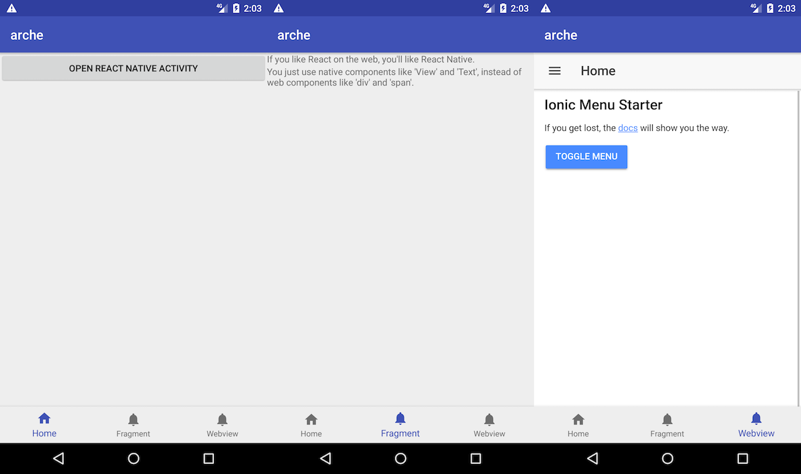

# Arche

> Arche 是一个 Android 移动应用模板——使用原生（Kotlin） Android 集成 React Native，以及 Ionic Web 框架、基于 React Native 的混合应用框架 Dore。

技术栈：

 - 原生 Android（Kotlin）
 - React Native
 - Ionic + Angular
 - Dore Framework

详细步骤见：[docs](./docs)

Screenshots
---

LICENSE
---

© 2018A [Phodal Huang](https://www.phodal.com)'s [Idea](http://github.com/phodal/ideas).  This code is distributed under the MIT license. See `LICENSE` in this directory.
