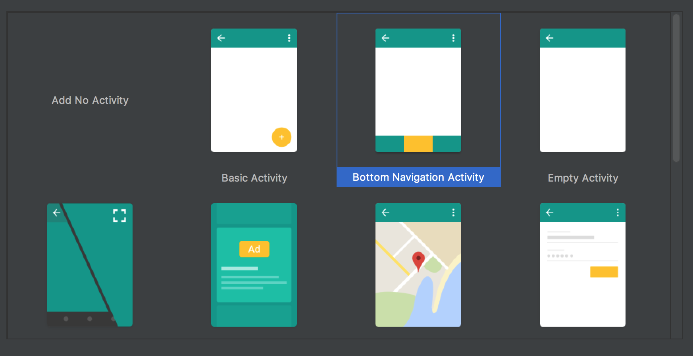

Android 应用开发：Kotlin + React Native + Dore + Ionic 3.x
===

为了总结去年的移动开发经验，我使用 Kotlin + React Native + Dore + Ionic 3.x 做了一个简单的模板项目：Arche。

Arche 是一个 Android 移动应用模板——使用原生（Kotlin） Android 集成 React Native，以及 Ionic Web 框架、基于 React Native 的混合应用框架 Dore。

其技术栈是：

 - 原生 Android（Kotlin）
 - React Native
 - Ionic + Angular
 - Dore Framework

创建原生 Android 项目
---

首先使用 Android Studio 创建项目



生成的 MainActivity 如下：

```kotlin
class MainActivity : AppCompatActivity() {

    private val mOnNavigationItemSelectedListener = BottomNavigationView.OnNavigationItemSelectedListener { item ->
        when (item.itemId) {
            R.id.navigation_home -> {
                message.setText(R.string.title_home)
                return@OnNavigationItemSelectedListener true
            }
            R.id.navigation_dashboard -> {
                message.setText(R.string.title_dashboard)
                return@OnNavigationItemSelectedListener true
            }
            R.id.navigation_notifications -> {
                message.setText(R.string.title_notifications)
                return@OnNavigationItemSelectedListener true
            }
        }
        false
    }

    override fun onCreate(savedInstanceState: Bundle?) {
        super.onCreate(savedInstanceState)
        setContentView(R.layout.activity_main)

        navigation.setOnNavigationItemSelectedListener(mOnNavigationItemSelectedListener)
    }
}
```

在这里，我使用的是 Fragment 来切换页面，逻辑如下：

```
private fun switchFragment(lastIndex: Int, index: Int) {
    val transaction = supportFragmentManager.beginTransaction()
    transaction.hide(fragments!![lastIndex])
    if (!fragments!![index].isAdded) {
        transaction.add(R.id.container, fragments!![index])
    }
    transaction.show(fragments!![index]).commitAllowingStateLoss()
}

private fun initFragments() {
    homeFragment = HomeFragment()
    archeReactFragment = ArcheReactFragment()
    archeWebViewFragment = ArcheWebViewFragment()
    fragments = arrayOf(homeFragment!!, archeReactFragment!!, archeWebViewFragment!!)
    lastShowFragment = 0
    supportFragmentManager
            .beginTransaction()
            .add(R.id.container, homeFragment)
            .show(homeFragment)
            .commit()
}
```

对应的，``mOnNavigationItemSelectedListener`` 就变成了：

```
private val mOnNavigationItemSelectedListener = OnNavigationItemSelectedListener { item ->
    when (item.itemId) {
        R.id.navigation_home -> {
            if (lastShowFragment != 0) {
                switchFragment(lastShowFragment, 0)
                lastShowFragment = 0
            }
            return@OnNavigationItemSelectedListener true
        }
        R.id.navigation_notifications -> {
            if (lastShowFragment != 1) {
                switchFragment(lastShowFragment, 1)
                lastShowFragment = 1;
            }
            return@OnNavigationItemSelectedListener true
        }
        R.id.navigation_webview -> {
            if (lastShowFragment != 2) {
                switchFragment(lastShowFragment, 2)
                lastShowFragment = 2
            }
            return@OnNavigationItemSelectedListener true
        }
    }
    false
}
```

其布局是：

```
<?xml version="1.0" encoding="utf-8"?>
<android.support.constraint.ConstraintLayout
    xmlns:android="http://schemas.android.com/apk/res/android"
    xmlns:app="http://schemas.android.com/apk/res-auto"
    xmlns:tools="http://schemas.android.com/tools"
    android:layout_width="match_parent"
    android:layout_height="match_parent"
    tools:context="arche.phodal.com.arche.MainActivity">

    <FrameLayout
        android:adjustViewBounds="true"
        android:id="@+id/container"
        android:layout_width="match_parent"
        android:layout_height="match_parent"
        android:orientation="vertical">

    </FrameLayout>

    <android.support.design.widget.BottomNavigationView
        android:id="@+id/navigation"
        android:layout_width="0dp"
        android:layout_height="wrap_content"
        android:layout_marginEnd="0dp"
        android:layout_marginStart="0dp"
        android:background="?android:attr/windowBackground"
        app:layout_constraintBottom_toBottomOf="parent"
        app:layout_constraintLeft_toLeftOf="parent"
        app:layout_constraintRight_toRightOf="parent"
        app:menu="@menu/navigation" />

</android.support.constraint.ConstraintLayout>
```

React Native 部份
---

### 创建 React Native 应用

```
npm install -g create-react-native-app


create-react-native-app RNArche

cd RNArche
npm start
```

### 生成项目

Inject

```
npm run inject
```

### 添加权限

添加 Overlay 的权限处理：

```
override fun onCreate(savedInstanceState: Bundle?) {
    super.onCreate(savedInstanceState)
    setContentView(R.layout.activity_main)

    navigation.setOnNavigationItemSelectedListener(mOnNavigationItemSelectedListener)

    if (BuildConfig.DEBUG && Build.VERSION.SDK_INT >= Build.VERSION_CODES.M) {
        if (!Settings.canDrawOverlays(this)) {
            val intent = Intent(Settings.ACTION_MANAGE_OVERLAY_PERMISSION,
                    Uri.parse("package:" + packageName))
            startActivityForResult(intent, OVERLAY_PERMISSION_REQ_CODE)
        }
    }
}


@SuppressLint("ShowToast")
override fun onActivityResult(requestCode: Int, resultCode: Int, data: Intent?) {
    super.onActivityResult(requestCode, resultCode, data)
    if (requestCode == OVERLAY_PERMISSION_REQ_CODE) {
        if (Build.VERSION.SDK_INT >= Build.VERSION_CODES.M) {
            if (!Settings.canDrawOverlays(this)) {
                Toast.makeText(this, "Lost Permissions", Toast.LENGTH_SHORT)
            }
        }
    }
}
```

以及 AndroidManifest.xml 中的：

```
<uses-permission android:name="android.permission.SYSTEM_ALERT_WINDOW"/>
```

### 创建 ReactApplication

我的是 ArcheApplication

```
class ArcheApplication : Application(), ReactApplication {
    private val mReactNativeHost = object : ReactNativeHost(this) {
        override fun getUseDeveloperSupport(): Boolean {
            return true
        }

        public override fun getPackages(): List<ReactPackage> {
            return Arrays.asList<ReactPackage>(
                    MainReactPackage()
            )
        }
    }

    override fun getReactNativeHost(): ReactNativeHost {
        return mReactNativeHost
    }
}
```

### 创建基础的 Fragment

```
abstract class ReactFragment : Fragment() {
    private var mReactRootView: ReactRootView? = null
    private var mReactInstanceManager: ReactInstanceManager? = null

    abstract val mainComponentName: String

    override fun onAttach(context: Context?) {
        super.onAttach(context)
        mReactRootView = ReactRootView(context)
        mReactInstanceManager = (activity.application as ArcheApplication)
                .reactNativeHost
                .reactInstanceManager

    }

    override fun onCreateView(inflater: LayoutInflater?, group: ViewGroup?, savedInstanceState: Bundle?): ReactRootView? {
        super.onCreate(savedInstanceState)
        return mReactRootView
    }


    override fun onActivityCreated(savedInstanceState: Bundle?) {
        super.onActivityCreated(savedInstanceState)
        mReactRootView!!.startReactApplication(
                mReactInstanceManager,
                mainComponentName,
                null
        )
    }
}
```

### 更新 MainActivity

然后在我们的 MainActivity 中实现对应的逻辑：

```
class MainActivity : AppCompatActivity(), DefaultHardwareBackBtnHandler {
    ...
    private var mReactInstanceManager: ReactInstanceManager? = null

    override fun onCreate(savedInstanceState: Bundle?) {
        super.onCreate(savedInstanceState)
        setContentView(R.layout.activity_main)

        navigation.setOnNavigationItemSelectedListener(mOnNavigationItemSelectedListener)
        mReactInstanceManager = (application as ArcheApplication).reactNativeHost.reactInstanceManager

        initFragments()

        if (BuildConfig.DEBUG && Build.VERSION.SDK_INT >= Build.VERSION_CODES.M) {
            if (!Settings.canDrawOverlays(this)) {
                val intent = Intent(Settings.ACTION_MANAGE_OVERLAY_PERMISSION,
                        Uri.parse("package:" + packageName))
                startActivityForResult(intent, OVERLAY_PERMISSION_REQ_CODE)
            }
        }
    }

    override fun onPause() {
        super.onPause()
        if (mReactInstanceManager != null) {
            mReactInstanceManager!!.onHostPause(this)
        }
    }

    override fun onResume() {
        super.onResume()

        if (mReactInstanceManager != null) {
            mReactInstanceManager!!.onHostResume(this, this)
        }
    }

    override fun invokeDefaultOnBackPressed() {
        super.onBackPressed()
    }
}
```

### 创建我们的 Fragment

```
class ArcheReactFragment : ReactFragment() {
    override val mainComponentName: String
        get() = "RNArche"

    private var mReactRootView: ReactRootView? = null
    private var mReactInstanceManager: ReactInstanceManager? = null

    @Nullable
    override fun onCreateView(inflater: LayoutInflater?, group: ViewGroup?, savedInstanceState: Bundle?): ReactRootView? {
        mReactRootView = ReactRootView(activity)
        mReactInstanceManager = ReactInstanceManager.builder()
                .setApplication(activity.application)
                .setBundleAssetName("index.android.bundle")
                .setJSMainModulePath("index")
                .addPackage(MainReactPackage())
                .setUseDeveloperSupport(BuildConfig.DEBUG)
                .setInitialLifecycleState(LifecycleState.RESUMED)
                .build()
        mReactRootView!!.startReactApplication(mReactInstanceManager, "RNArche", null)
        return mReactRootView
    }
}
```

这里的 ``"RNArche"`` 需要和 React Native 中注册的 Component 保持一致：

```
AppRegistry.registerComponent('RNArche', () => App);
```

在这里，也可以注册多个 Component

```
AppRegistry.registerComponent('RNArche', () => App);
AppRegistry.registerComponent('RNArche2', () => App2);
```

当然，也可以创建一个自己的 Activity 来做对应的事情。

WebView
---

好了，现在，让我们来创建我们的 WebView 应用：

```
npm install -g cordova ionic

ionic start archeWebview sidemenu
```

然后下面的命令，来生成最后的 www 文件：

```
ionic build --prod
```

将其复制到 ``assets`` 目录下。

对应的 Android 代码如下：

```
@SuppressLint("SetJavaScriptEnabled")
@Nullable
override fun onCreateView(inflater: LayoutInflater?, container: ViewGroup?, savedInstanceState: Bundle?): View? {
    val view = inflater?.inflate(R.layout.fragment_webview, container, false)

    avi = view?.findViewById(R.id.avi)
    mWebView = view?.findViewById(R.id.webview)

    mWebView!!.loadUrl("file:///android_asset/www/index.html")

    val webSettings = mWebView!!.settings
    webSettings.javaScriptEnabled = true
    mWebView!!.webViewClient = WebViewClient()

    return view
}
```

然后，我也顺手添加了一个 Loading 效果：

```
private fun setLoadingProgress() {
    mWebView!!.webViewClient = object : WebViewClient() {
        override fun onPageStarted(view: WebView?, url: String?, favicon: Bitmap?) {
            avi!!.show()
            super.onPageStarted(view, url, favicon)
        }

        override fun onPageFinished(view: WebView?, url: String?) {
            avi!!.hide()
            super.onPageFinished(view, url)
        }
    }
}
```

对应的 XML 如下：

```
<?xml version="1.0" encoding="utf-8"?>
<LinearLayout xmlns:android="http://schemas.android.com/apk/res/android"
    xmlns:app="http://schemas.android.com/apk/res-auto"
    android:layout_width="match_parent"
    android:layout_height="match_parent"
    android:orientation="vertical">

    <LinearLayout
        android:id="@+id/information_detail"
        android:layout_width="match_parent"
        android:layout_height="match_parent"
        android:layout_gravity="center_horizontal"
        android:orientation="vertical">

        <com.wang.avi.AVLoadingIndicatorView
            android:id="@+id/avi"
            style="@style/AVLoadingIndicatorView"
            android:layout_width="match_parent"
            android:layout_height="match_parent"
            android:layout_gravity="center_horizontal"
            android:visibility="visible"
            app:indicatorColor="#000"
            app:indicatorName="BallClipRotateMultipleIndicator" />

        <WebView
            android:id="@+id/webview"
            android:layout_width="match_parent"
            android:layout_height="match_parent"
            android:scrollbars="none" />

    </LinearLayout>

</LinearLayout>
```

Q & A
---

### 问题libgnustl_shared.so" is 32-bit instead of 64-bit

在 build.gradle 中添加 ndk 配置：

```
android {
    compileSdkVersion 26
    defaultConfig {
        applicationId "arche.phodal.com.arche"
        minSdkVersion 16
        targetSdkVersion 26
        versionCode 1
        versionName "1.0"
        testInstrumentationRunner "android.support.test.runner.AndroidJUnitRunner"
        vectorDrawables.useSupportLibrary= true
        ndk {
            abiFilters "armeabi-v7a", "x86"
        }
    }
    buildTypes {
        release {
            minifyEnabled false
            proguardFiles getDefaultProguardFile('proguard-android.txt'), 'proguard-rules.pro'
        }
    }
}
```

### Bundle files

```
cp ./RNArche/android/app/build/intermediates/assets/release/index.android.bundle ./app/src/main/assets/index.android.bundle
```

问题：

```
java.lang.ClassCastException: android.app.Application cannot be cast to arche.phodal.com.arche.ArcheApplication
```

在 AndroidManifest.xml 添加对应的 application

```
    <application
        android:name=".ArcheApplication"
        android:allowBackup="true"
        android:icon="@mipmap/ic_launcher"
        android:label="@string/app_name"
        android:roundIcon="@mipmap/ic_launcher_round"
        android:supportsRtl="true"
        android:theme="@style/AppTheme">
```
